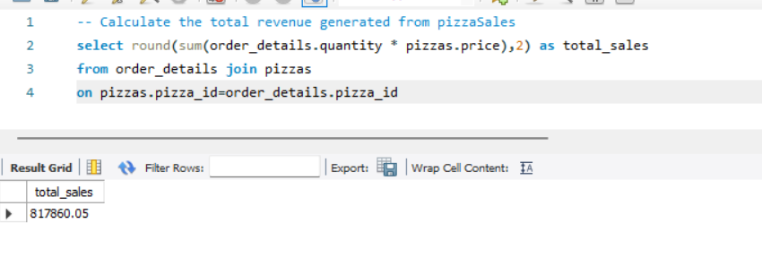
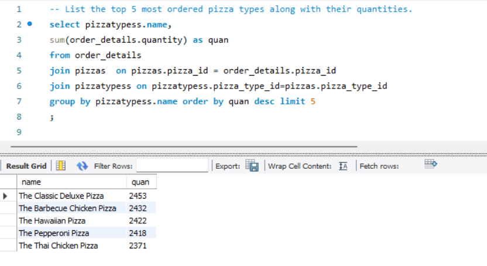
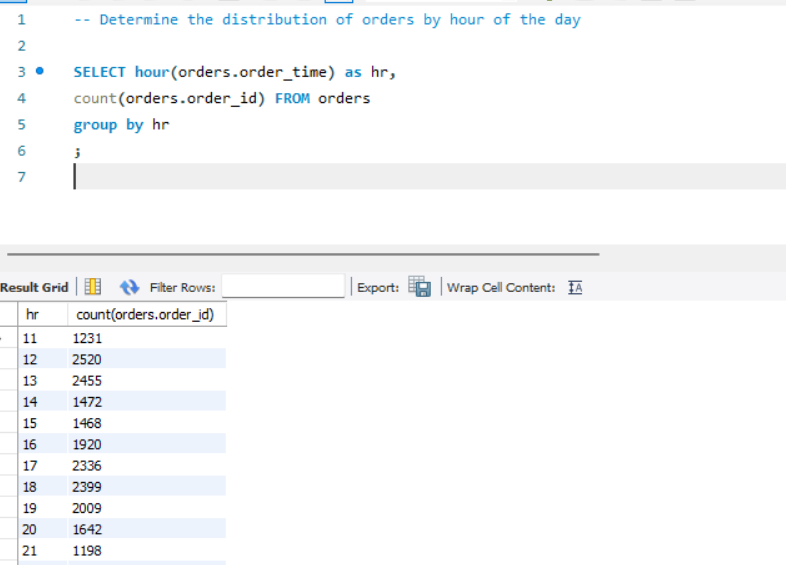

# Pizza Sales Analysis using SQL

## Project Overview

This project analyzes pizza sales data using SQL to extract meaningful business insights such as revenue trends, customer ordering patterns, and top-performing pizza types.

The goal of this project is to demonstrate practical SQL skills used in data analysis including joins, aggregations, grouping, and window functions.

---

## Dataset

The dataset contains four related tables representing pizza sales transactions.

Tables included:

- **orders** – Contains order ID, date, and time of each order.
- **order_details** – Contains quantity and pizza IDs associated with each order.
- **pizzas** – Contains pizza size and price information.
- **pizza_types** – Contains pizza names, categories, and ingredients.

---

## Database Schema

The dataset structure follows this relationship:

```
orders
   │
order_details
   │
pizzas
   │
pizza_types
```

---

## Business Questions Solved

### Basic Analysis

1. Retrieve the total number of orders placed.
2. Calculate the total revenue generated from pizza sales.
3. Identify the highest priced pizza.
4. Identify the most common pizza size ordered.
5. List the top 5 most ordered pizza types along with their quantities.

---

### Intermediate Analysis

1. Find the total quantity of each pizza ordered.
2. Determine the distribution of orders by hour of the day.
3. Find the category-wise distribution of pizzas.
4. Calculate the average number of pizzas ordered per day.
5. Determine the top 3 most ordered pizza types based on revenue.

---

### Advanced Analysis

1. Calculate the percentage contribution of each pizza type to total revenue.
2. Analyze cumulative revenue generated over time.
3. Determine the top 3 most ordered pizza types based on revenue for each pizza category.

---

## Tools Used

- **MySQL Workbench**
- **SQL**
- **GitHub**

---

## Key SQL Skills Demonstrated

- SQL Joins
- Aggregation Functions
- Group By Analysis
- Window Functions
- Revenue Calculations
- Time-based Analysis

---

## Project Structure

```
pizza-sales-sql-analysis
│
├── dataset
│   ├── orders.csv
│   ├── order_details.csv
│   ├── pizzas.csv
│   └── pizza_types.csv
│
├── sql_queries
│   ├── basic_analysis.sql
│   ├── intermediate_analysis.sql
│   └── advanced_analysis.sql
│
├── images
│   └── query results screenshots
│
└── README.md
```

---

## Acknowledgment

This project is inspired by a guided SQL project available on YouTube uploaded by WScube Teach. The analysis and SQL implementation were completed independently for learning and portfolio purposes.

## Sample Query Results

### Total Orders Placed


---

### Total Revenue Generated



---

### Top 5 Most Ordered Pizzas



---

### Orders Distribution by Hour


